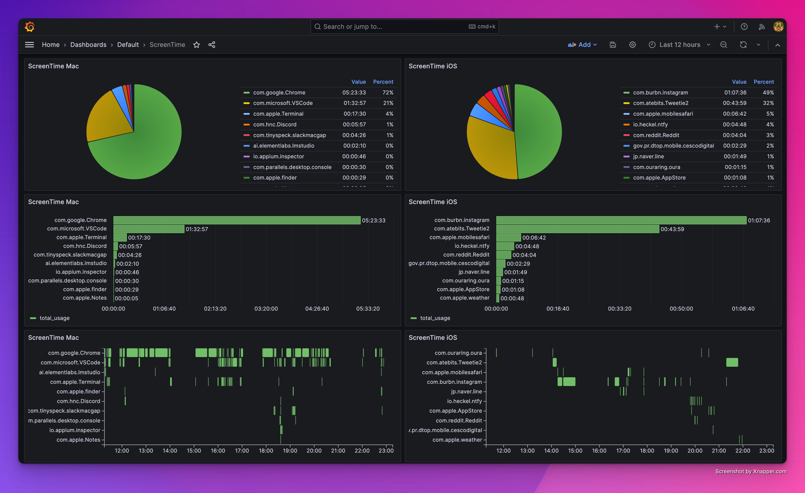

# ScreenTime Scraper
macOS saves ScreenTime data for all your iCloud enabled devices inside of a local SQLite file stored in `~/Library/Application Support/Knowledge/knowledgeC.db`. This app fetches that data and sends it to a configured server endpoint. Will add CSV download option later.

### Note
This code kinda sucks and should not be used by anyone for any reason.

## Quick Start
If you just want to see what your raw ScreenTime data looks like, you can run the following command in your terminal. This will fetch the data from knowledgeC.db and print it to the console.
```bash
cd tests
pip install -r requirements.txt
python list.py
```

and this will make a simple chart of your daily usage
```bash
python segmentplot2.py
```


For a more advanced use case, this is an example dashboard I built in grafana:


## Overview
The ScreenTime Scraper app has the following features:
- Fetches usage data from the knowledgeC.db SQLite database on macOS
- Maps the SQLite data to JSON and sends it to a configured database endpoint
- TODO: ~~Saves the data locally as a CSV file~~
- Runs on a schedule to sync data automatically
- Includes menu bar app and preference pane for configuration

## Installation
TODO: Add a packaged binary to the releases page.

## Development

This has only been tested with nodejs `v18.15.0`

Clone the repo
```bash
git clone git@github.com:your-username/screentime-scraper.git
```
Install dependencies
```bash
cd screentime-scraper
npm i
```
Run the app in development mode
```bash
npm run start
```
Creat a binary file to run the app at startup and on a schedule
```bash
npm run package
```
The packaged file will be created in the `out` directory. Copy it to your Applications folder and run it. The app will run in the menu bar. It will automatically add itself to your login items so it will run at startup.

### IMPORTANT:
The app will automatically open the System Preferences app and prompt you to give it Full Disk access. If you don't give it access, it will not work.

## Usage
The main app runs in the menu bar. Click the icon to open the preference pane.

In the preferences, enter your server endpoint URL and choose a sync frequency. Data will be fetched from knowledgeC.db and synced based on this schedule.

Usage data includes:
- Start/end times
- URL (web usage only)
- Device name
- App name
- Usage duration
- Date

Both app usage and web usage data are synced. Web events include the visited URL.

## Sync Process
1. Fetch data from knowledgeC.db
2. Map data to JSON
3. Send JSON to server endpoint
4. TODO: ~~Save data locally as CSV~~
5. Sleep until next sync time

## JSON Schema
The JSON data is mapped to the following schema:

### App Usage Data

```json
{
  "time_start": "2020-01-01T00:00:00.000Z",
  "time_end": "2020-01-01T00:00:00.000Z",
  "app_name": "com.apple.Safari",
  "device_id": "1234567890",
  "device_name": "iPhone",
  "gmt_offset": -5
}
```

### Web Usage Data
```json
{
  "time_start": "2020-01-01T00:00:00.000Z",
  "time_end": "2020-01-01T00:00:00.000Z",
  "app_name": "com.something.Safari",
  "url": "https://www.google.com",
  "device_id": "1234567890",
  "device_name": "iPhone",
  "gmt_offset": -5
}
```